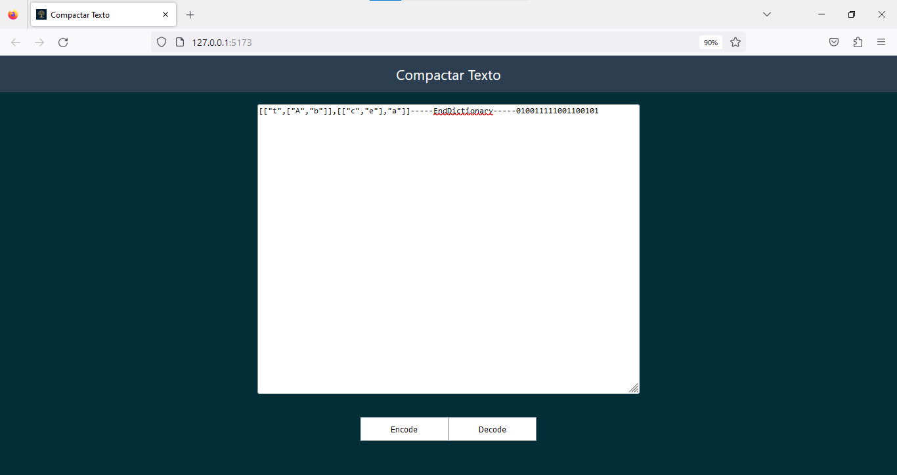

Tema:

- Algoritmo Ambiciosos

# Vira-Tempo 


## Alunos

| Matrícula | Aluno                     |
| ---------- | ------------------------- |
| 200018060  | Gabriel Ferreira da Silva |
| 200044567  | Weslley Alves de Barros   |

Dupla 06

## Sobre

O projeto Vira-Tempo, consiste na utilização de Código de Huffman, par compactar e descompactar textos, de formas a gerar mensagens codificadas para pessoas e para seu remetente decodificar, se quiser.

## Screenshots



## Instalação

**Linguagem**: Javascript
**Framework**: VueJS

## Requisitos

**Node versão**: 16
**NPM**: 8.15

## Uso

Explique como usar seu projeto caso haja algum passo a passo após o comando de execução.

Passo a passo para rodar o projeto

```bash
npm i
npm run dev
```

ou acessar pelo [link](https://projeto-de-algoritmos.github.io/Greed_compactartexto/)

[Video](https://youtu.be/7KhCg3rJKMM)
